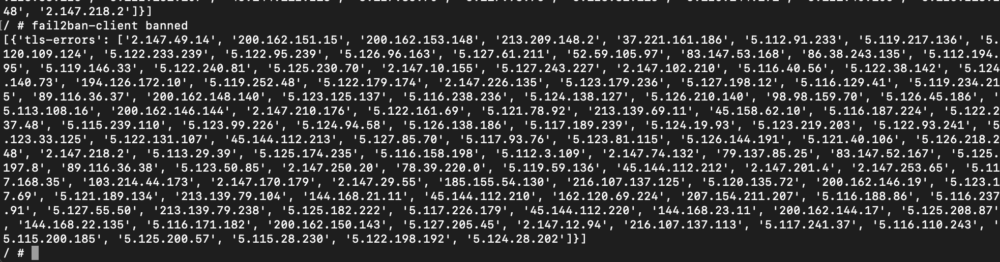
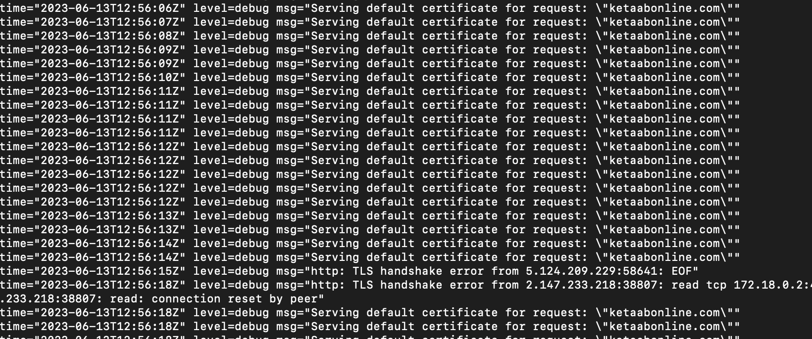

# traefik2ban
Traefik and fail2ban

  

Recently I got a new cloud server with a so well known IP :( so it has pleeeenty of requests from bots
Sadly didn't find a nice way to block them with [Traefik](https://doc.traefik.io/traefik/) so decided
to start looking for alternatives and found [fail2ban](https://www.fail2ban.org)

This reposotiry contains a Traefik docker file with fail2ban and logrotate extras

This is how it looks in action

Inspired by
> https://geekland.eu/usar-fail2ban-con-traefik-para-proteger-servicios-que-corren-en-docker/
